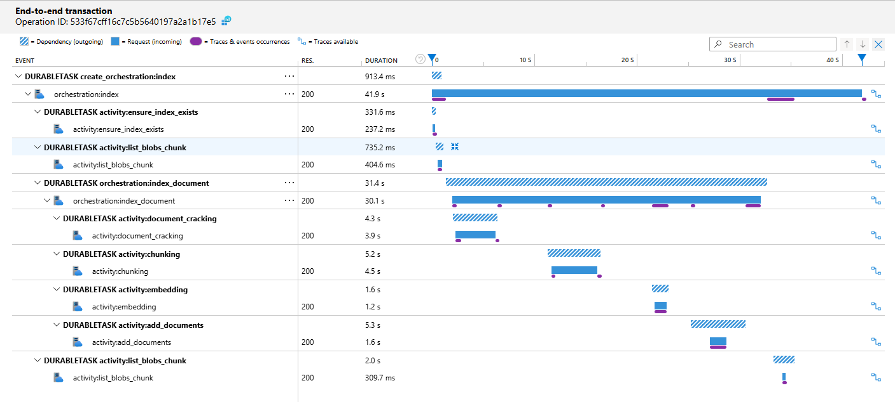

# Indexadillo


Durable Indexing helps you push data to Azure AI Search in a scalable, observable way. Instead of using a pull-based DSL
approach (which can be tricky to debug and customize), this solution uses Azure Durable Functions to handle everything from
parsing your documents to uploading embeddings—without restarting at every little hiccup.


## What’s Inside?

![A workflow diagram shows two data sources labeled “HTTP” and “BLOB” flowing into a “Documents” box. From there, four steps are repeated for each document: “Cracking,” “Chunking,” “Embedding,” and “Upload.” In the diagram, “Cracking” and “Chunking” are highlighted in green to indicate they have started, while “Embedding” and “Upload” are gray to show they haven’t begun yet. A small note above the arrow from “Chunking” to “Embedding” reads “for each document,” emphasizing that all steps happen for each file.](assets/workflow.png)

- **Orchestrators and Activities:** Each document gets its own sub-orchestrator, so failures don't bring everything down.  
- **Blob Storage Input:** Drop your PDFs into blob storage, and we’ll automatically pick them up.  
- **Document Intelligence:** Extract text from documents before sending them on.  
- **“Chonkie” for Chunking:** Break down big files into smaller pieces for easier processing.  
- **OpenAI Text-003-Large Embeddings:** Transform your text into embeddings for full-text AI search.  
- **Azure AI Search Upload:** All neatly sent to your search index.  
- **Scalability:** Process documents in parallel without losing track, thanks to continuation tokens and Durable Functions’ built-in retries.

## Getting Started

### Quick Start & Prerequisites
1. **Environment Setup**
   - **Azure Account:** Ensure you have an active Azure subscription.
   - **Tools:** Install [Azure CLI](https://learn.microsoft.com/cli/azure/install-azure-cli) and
     [azd](https://github.com/azure/azure-dev).
      > Not needed for the dev container setup.
   - **Dev Environment:** Kick things off with VS Code and the provided dev container.

2. **Deploy Your Infrastructure**
   - Create a new environment:
     ```bash
     azd env new indexadillo-dev
     ```
   - Authenticate with Azure:
     ```bash
     azd auth login
     az login
     ```
   - Provision your resources:
     ```bash
     azd up
     ```
     This command sets up the necessary infrastructure (storage, function app, AI Search, etc.). Follow the prompts to select a subscription and region (Sweden Central is recommended).

3. **Detailed Setup (Optional)**
   - **Roles & Permissions:** Run the roles script to assign necessary permissions:
     ```bash
     ./scripts/roles.sh
     ```
   - **Document Upload:** Place your PDFs into the `source` container within your storage account.
   - **Monitoring:** 
     - Check the processing in Application Insights:
       
     - Or view the function app’s invocations by selecting the `index_event_grid` function and switching to the "Invocations" tab.
   - **Accessing Search:** Use the AI Search portal or the provided [Bruno collection](https://www.usebruno.com/) in the `/http` folder. (Don’t forget to update the `host` variable in the collection settings with your function app name.)
   - **Reindexing:** Trigger a full reindex via the `/index` endpoint. This creates a new index (defaulted to `other-index`, can
     be changed in the parameters) for the blobs. You can adjust the prefixes to index specific folders, and the endpoint returns an ID to track progress
     via `/status/:id`.

### Local Debugging

1. **Setup `local.settings.json`**  
   Place the following `local.settings.json` file in the `src` folder:

   ```json
   {
     "IsEncrypted": false,
     "Values": {
       "AzureWebJobsStorage": "UseDevelopmentStorage=true",
       "SOURCE_STORAGE_ACCOUNT_NAME": "<source_storage_account_name>",
       "DI_ENDPOINT": "<di_endpoint>",
       "FUNCTIONS_WORKER_RUNTIME": "python",
       "AzureWebJobsFeatureFlags": "EnableWorkerIndexing",
       "AZURE_OPENAI_ENDPOINT": "<azure_openai_endpoint>",
       "SEARCH_SERVICE_ENDPOINT": "<search_service_endpoint>"
     }
   }
   ```

2. **Configure Endpoints**  
   Fill out `DI_ENDPOINT`, `AZURE_OPENAI_ENDPOINT`, `SOURCE_STORAGE_ACCOUNT_NAME`, and `SEARCH_SERVICE_ENDPOINT` with the correct endpoints from the `.env` file located at `.azure/indexadillo-dev/.env`.

3. **Start Azurite Service**  
   Launch the Azurite service by using the **Azurite: Start** command from the VS Code command palette.

4. **Run the Debugger**  
   In the VS Code debug section, select and run the **Attach to Python Function** configuration.

## State Management & Scalability
- **Status Monitoring:** Each indexing run is tied to a sub-orchestrator. You can see exactly how far along it is, and if something fails, you can resume without starting over.  
- **Parallel Processing:** Handle as many documents as you want in parallel (just adjust your function settings).  

## Contributing
Feel free to open issues or submit pull requests if you’d like to help out. All improvements are welcome—whether that’s more chunking strategies, extra integration tests, or better docs.

## License
[MIT License](LICENSE)
